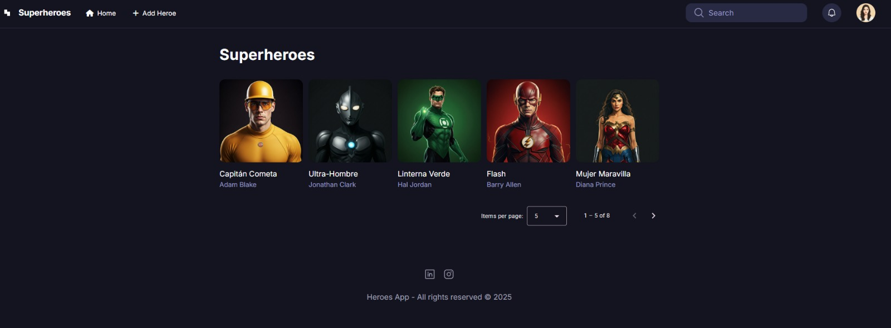

# 💥 RIU Frontend - Benitez Emmanuel

Aplicación frontend desarrollada con Angular para el sistema RIU. Provee una interfaz moderna y dinámica para la gestión de héroes y otras entidades, con soporte para paginación, filtrado y edición.

### 📦 Demo

Accedé a la aplicación funcionando en el siguiente enlace:

🔗 [riuheroapp.netlify.app](https://riuheroapp.netlify.app/dashboard/heroes)

## 🚀 Tecnologías utilizadas

- ✅ Angular 19
- 🎨 TailwindCSS
- 📦 Angular Material
- 🔁 Signals
- ⏳ Ngx Spinner

## 📸 Vista previa



## 📦 Instalación

```bash
git clone https://github.com/emanuel7benitez/RIU-Frontend-Benitez-Emmanuel.git
cd RIU-Frontend-Benitez-Emmanuel
npm install
npm run start
```

## 🧪 Testing

```bash
ng test
```

## 📁 Estructura del proyecto

```
├── public/
│   └── img/           # Imágenes accesibles públicamente, como avatares o recursos cargados por el usuario
├── src/
│   └── app/
│       └── heroes/
│           ├── components/   # Componentes reutilizables como tarjetas, encabezados o formularios
│           ├── interfaces/   # Tipado TypeScript (interfaces como Superheroe, etc.)
│           ├── pages/        # Vistas principales como listado de héroes o detalle
│           └── services/     # Servicios de Angular como el manejo de datos o lógica de negocio


```

## ✅ Funcionalidades principales

- Listado paginado de héroes
- Filtro en tiempo real por nombre, alias o poderes
- Creación, edición y eliminación lógica de héroes
- Visualización detallada por ID con rutas dinámicas
- Spinner de carga simulado con delay opcional

## 👨‍💻 Autor

- [Emmanuel Benitez](https://github.com/emanuel7benitez)

---

📌 *Este proyecto fue desarrollado como parte de una práctica técnica con enfoque en buenas prácticas, arquitectura limpia y uso de Angular Signals.*
